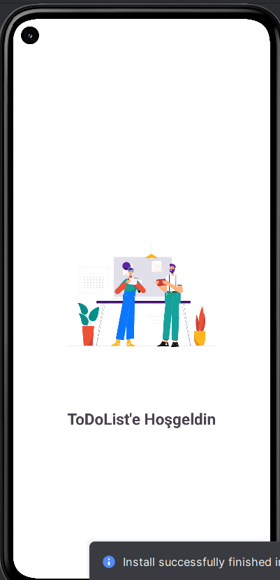
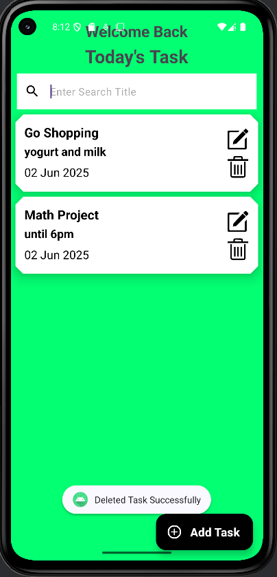
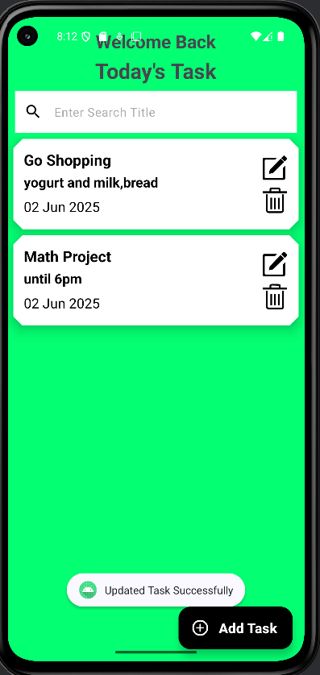
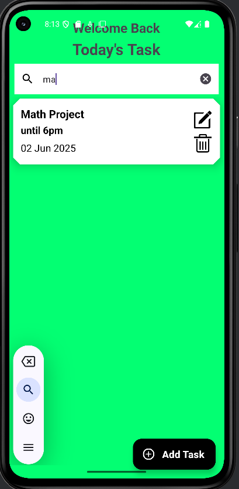
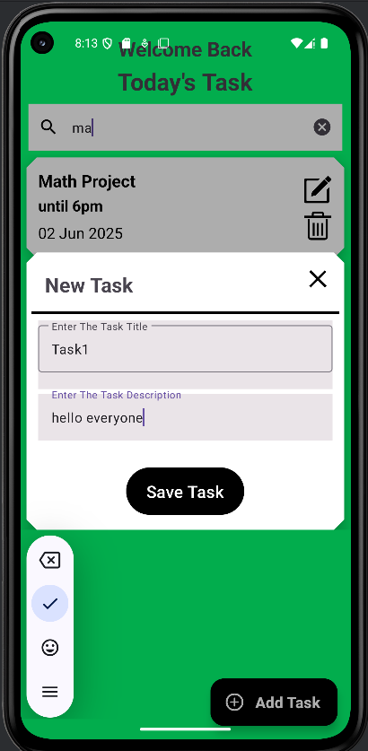
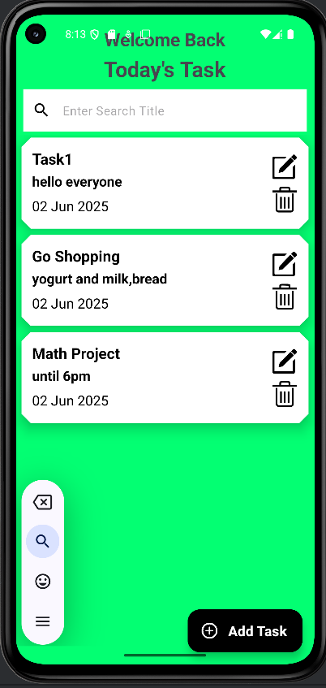

# ✅ ToDo App

A simple and intuitive ToDo List Android application built with Kotlin. It allows users to **add**, **update**, **delete**, and **search tasks** with a smooth and modern UI experience.

---

## ✨ Features

- ✅ Add new tasks with title and description  
- 🔁 Update or delete existing tasks  
- 🔍 Search tasks dynamically  
- 🎬 Animated splash screen using Lottie  
- 🧾 Responsive and user-friendly dialogs for input  
- 🗂️ Data persistence with Room database  
- 🛡️ Real-time input validation and feedback  

---

## 📸 Screenshots

### Splash Screen  

### View Tasks  

### Delete Task  

### Update Task  

### After Update  

### Search Task  

### Add Task  

### After Adding  

---

## 🚀 Installation

1. Clone the repo:  
   `git clone https://github.com/dilakemer/todoapp.git`

2. Open the project in Android Studio.

3. Build and run on an emulator or physical device with Android API 21+.

## Usage

- Tap the "+" button to add a new task.
- Tap on a task to update or delete it.
- Use the search bar to filter tasks.

## Architecture & Tech Stack

- Kotlin & Android Jetpack
- MVVM architecture with ViewModel and LiveData
- Room database for local data storage
- Coroutines for asynchronous operations
- Lottie animations for splash screen

## Code Overview

- `SplashActivity`: Shows the animated splash screen on app start.
- `MainActivity`: Handles displaying, adding, updating, deleting, and searching tasks.
- `TaskViewModel`: Manages task data operations and state.
- `TaskRVVBListAdapter`: RecyclerView adapter for displaying the list of tasks.

## Contributing

Contributions are welcome! Please fork the repository and submit a pull request.

